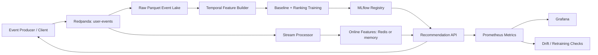

# Real-Time Recommendation & Personalization Platform

This repository implements a portfolio-grade, locally runnable recommendation platform that closes the loop from behavioral events to online features, model training, evaluation, serving, monitoring, and retraining. The default path uses a lightweight local runtime so the core ML lifecycle can be exercised without cloud infrastructure; Docker Compose adds Redpanda, Redis, PostgreSQL, MinIO, MLflow, Prometheus, and Grafana for an operationally realistic demo.

## Architecture



The implementation keeps the operational boundaries explicit. `common` owns schemas and reusable domain logic, `ingestion` owns synthetic data and event persistence, `streaming` owns event-to-feature updates, `features` owns point-in-time feature construction, `models` owns candidate generation and ranking, `training` owns reproducible model artifacts, `evaluation` owns ranking metrics and promotion policy, `api` owns serving, and `monitoring` owns Prometheus and drift signals.

## Technology stack

| Layer | Implementation |
| --- | --- |
| API | FastAPI, Pydantic v2, Uvicorn |
| Events | Kafka-compatible Redpanda, JSON schema, idempotent consumer logic |
| Storage | Parquet event lake, PostgreSQL metadata, Redis online features |
| Feature store | Feast repository plus the same feature definitions used by the local online store |
| ML | pandas, NumPy, scikit-learn logistic ranking model, temporal evaluation |
| Registry | MLflow integration with a local artifact fallback |
| Observability | Prometheus metrics, Grafana dashboards, JSON logs, drift reports |
| Deployment | Docker Compose, Kubernetes manifests, Helm chart, GitHub Actions |

## Quick start

```bash
python -m venv .venv
source .venv/bin/activate
pip install -e '.[dev]'
make generate-data
make train
make test
make run-api
```

The API is available at `http://localhost:8000`, with interactive OpenAPI documentation at `/docs`. The local API intentionally starts without external services: it loads the generated catalog and model artifacts and uses an in-process feature store. To run the full development topology, copy `.env.example` to `.env` and execute `docker compose up -d --build`.

## Example API calls

```bash
curl http://localhost:8000/health
curl 'http://localhost:8000/recommendations/user_000001?limit=5'
curl -X POST http://localhost:8000/events \
  -H 'content-type: application/json' \
  -d '{"event_id":"demo-event-0001","event_type":"click","user_id":"user_000001","item_id":"item_000001","timestamp":"2026-08-20T12:00:00Z","session_id":"session-demo","device_type":"mobile","metadata":{"source":"curl"}}'
```

## ML lifecycle

`make generate-data` creates deterministic users, items, and behaviorally correlated interactions. `make train` performs a temporal split, computes point-in-time features, evaluates popularity and category baselines, trains a supervised ranking model, writes a versioned artifact, and optionally logs to MLflow. `make evaluate` emits a machine-readable evaluation report. `make demo` runs the complete local event, feature, recommendation, and monitoring loop.

## Verification

```bash
make lint
make typecheck
make test
make validate-compose
```

The performance targets in the brief are engineering goals, not claims. Run `make benchmark` to measure local recommendation latency and write results to `data/processed/benchmark.json`. Load-test scripts live under `scripts/load_test.py`; Kubernetes and Helm manifests are deployment templates and are not presented as deployed infrastructure.

## Documentation map

| Document | Purpose |
| --- | --- |
| [ARCHITECTURE.md](docs/ARCHITECTURE.md) | Component boundaries and data flow |
| [DEVELOPMENT.md](docs/DEVELOPMENT.md) | Local development workflow |
| [DEPLOYMENT.md](docs/DEPLOYMENT.md) | Compose, Kubernetes, and Helm deployment |
| [ML_PIPELINE.md](docs/ML_PIPELINE.md) | Temporal training, evaluation, registry, and retraining |
| [FEATURE_STORE.md](docs/FEATURE_STORE.md) | Feature definitions, TTLs, and point-in-time guarantees |
| [MONITORING.md](docs/MONITORING.md) | Metrics, drift, dashboards, and alerts |
| [API.md](docs/API.md) | HTTP contract |
| [EXPERIMENTS.md](docs/EXPERIMENTS.md) | Deterministic A/B testing and canary rollout |
| [TROUBLESHOOTING.md](docs/TROUBLESHOOTING.md) | Common local failures |
| [IMPLEMENTATION_STATUS.md](IMPLEMENTATION_STATUS.md) | Acceptance status by phase |

## License

MIT. See [LICENSE](LICENSE).
