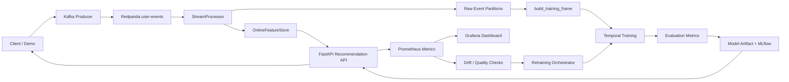
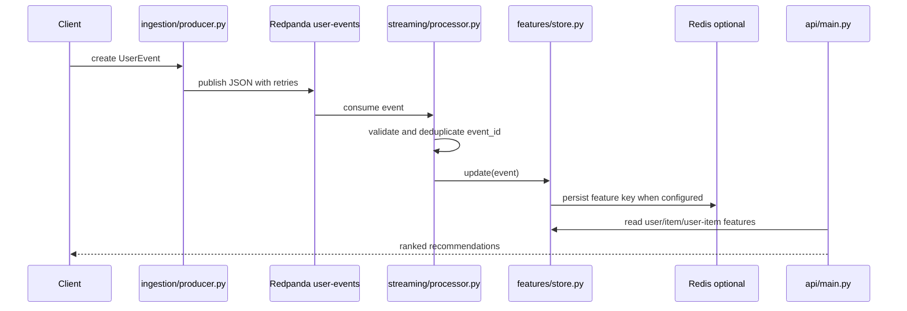
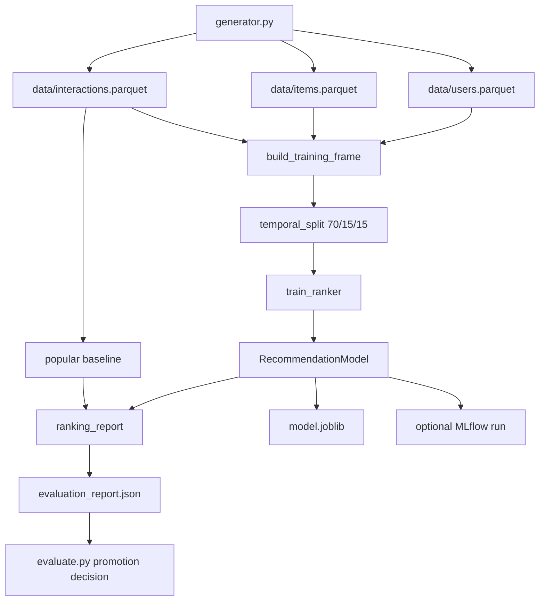
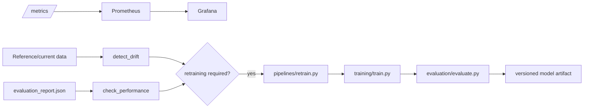

# Real-Time Recommendation Platform — Implementation Guide

## 1. Purpose and scope

This document explains how the repository was built, what each implementation phase delivered, why each major technology was selected, and how the files connect to form one end-to-end recommendation platform. It is intentionally explicit about the difference between a working local implementation, an optional integration, and a deployment template that still requires an external runtime.

> The platform is a portfolio-grade local reference implementation. It demonstrates the core ML feedback loop and supplies production-oriented integration boundaries, but it does not claim that a Redpanda cluster, Docker environment, Kubernetes cluster, or live model canary has been deployed from the sandbox.

## 2. Executive architecture



The implementation has two execution paths. The **local path** runs with Parquet files and an in-process online feature store, which keeps tests and development fast. The **Compose path** adds Redpanda, Redis, PostgreSQL, MinIO, MLflow, Prometheus, and Grafana. The **Kubernetes path** provides deployment templates, probes, resources, secrets, and autoscaling for the API.

## 3. Phase-by-phase implementation

The original brief contained phases 0 through 24. The table below records what was implemented, how it works, and the verification state.

| Phase | Objective | Implementation in this repository | Status and boundary |
| --- | --- | --- | --- |
| 0. Project foundation | Establish a professional repository | `pyproject.toml`, `.env.example`, `Makefile`, package layout, typed settings, structured logging, tests, docs, Docker, Kubernetes, Helm, and CI directories | **Implemented and locally quality-checked** |
| 1. Synthetic data generation | Create users, items, and correlated interactions | `ingestion/generator.py` creates latent category preferences, activity, price sensitivity, item popularity, temporal events, and configurable event weights; it writes Parquet and `data_profile.json` | **Implemented and executed** |
| 2. Kafka/Redpanda ingestion | Publish and consume validated events | `ingestion/producer.py` uses a Kafka-compatible producer with retries and local spool fallback; `streaming/processor.py` validates events and handles malformed payloads | **Implemented; external broker not run in sandbox** |
| 3. Raw event storage | Preserve reproducible historical data | `ingestion/storage.py` validates `UserEvent` records, drops duplicate IDs, writes UTC `year/month/day` Parquet partitions, and records `ingestion_metadata.json`; the API also keeps a JSONL raw-event path | **Implemented and tested** |
| 4. Real-time stream processing | Update features from event streams | `StreamProcessor` deduplicates by `event_id`, updates the online store, and records dead letters; `streaming/bytewax_pipeline.py` provides an optional Bytewax adapter | **Core processor implemented; Bytewax adapter requires optional runtime** |
| 5. Feast feature store | Share offline and online feature definitions | `feast/feature_store.yaml` configures local Feast with Redis online storage; `feast/features.py` declares `user`, `item`, and `user_item` entities and feature views; `features/store.py` contains the executable feature logic | **Definitions implemented; Feast materialization not exercised locally** |
| 6. Baseline recommenders | Establish measurable baselines | `popular_candidates()` supplies weighted popularity and `category_candidates()` supplies preferred-category recommendations; ranking metrics support baseline comparison | **Popular and category baselines implemented; separate collaborative-filtering and recently-popular classes were not added** |
| 7. ML recommender | Train a supervised ranking model | `models/recommender.py` trains a reproducible scikit-learn logistic ranking model using user, item, user-item, and context features | **Implemented and executed** |
| 8. MLflow experiment tracking | Track training metadata and artifacts | `training/train.py` records feature version, dataset version, metrics, and model artifact metadata; MLflow logging is opt-in through `ENABLE_MLFLOW=true` | **Local artifact path verified; live MLflow registry requires Compose or another server** |
| 9. Automated model evaluation | Compare candidates and approve promotion | `evaluation/metrics.py` calculates Precision, Recall, MAP, NDCG, and Hit Rate; `evaluation/evaluate.py` applies an NDCG gain threshold over the baseline | **Implemented; current policy compares against the baseline rather than a remote production registry version** |
| 10. Recommendation API | Serve production-shaped HTTP endpoints | `api/main.py` provides `/health`, `/ready`, `/metrics`, `/recommendations/{user_id}`, `/events`, `/model`, and `/experiments` with Pydantic validation and OpenAPI | **Implemented and smoke-tested** |
| 11. Candidate generation and ranking | Avoid scoring the complete catalog | The API merges category candidates with popular candidates, deduplicates them, and scores only the merged candidate set; it returns a fallback/popular path when the model is unavailable | **Implemented with category and popularity sources; recent-view and collaborative sources are extension points** |
| 12. Model export and optimization | Support portable optimized serving | `scripts/export_onnx.py` exports the estimator through `skl2onnx` when optional dependencies are installed; `scripts/benchmark.py` measures Python model scoring latency | **Export path implemented but not executed because ONNX conversion dependencies were optional** |
| 13. API and infrastructure monitoring | Expose operational metrics | The API emits request counters, latency histograms, event counters, recommendation counters, and fallback counts; Prometheus and Grafana configurations are included | **Implemented and locally exercised through `/metrics`; Compose monitoring not started in sandbox** |
| 14. Data and feature drift | Detect distribution changes | `monitoring/monitor.py` calculates PSI for numeric reference/current data and sets `recommendation_retraining_required` when the configured threshold is exceeded | **Implemented; categorical drift is represented by extension points rather than a separate categorical test** |
| 15. Model performance monitoring | Detect recommendation-quality degradation | `check_performance()` records NDCG and compares it to a configured minimum; the monitoring report stores drift and performance decisions | **Implemented for NDCG; CTR and conversion require online ground-truth event aggregation** |
| 16. Automated retraining | Retrain after drift or degradation | `pipelines/retrain.py` checks drift and performance, writes a monitoring report, and invokes the reproducible training pipeline only when triggered | **Implemented as a deterministic command; no external scheduler is configured** |
| 17. Canary deployment | Roll out a candidate safely | `models/deployment.py` implements 10%, 25%, 50%, and 100% rollout steps plus rollback; `docs/EXPERIMENTS.md` defines health gates | **Policy/state machine implemented; live traffic routing requires ingress/service-mesh infrastructure** |
| 18. A/B testing | Keep users in stable experiment buckets | `deterministic_bucket()` uses SHA-256 of experiment name and user ID; the API exposes control versus treatment metadata | **Implemented and tested** |
| 19. CI/CD | Automate quality checks and image builds | `.github/workflows/ci.yml` runs Ruff, Mypy, pytest, and a Docker image build for pull requests and main pushes | **Implemented; image publishing, security scanning, and deployment are intentionally not enabled** |
| 20. Docker Compose | Reproduce the complete development topology | `docker-compose.yml` defines Redpanda, PostgreSQL, Redis, MinIO, MLflow, API, stream processor, Prometheus, and Grafana with health checks | **Configuration committed; Docker CLI unavailable in the sandbox, so startup was not executed** |
| 21. Kubernetes | Provide production deployment resources | `k8s/recommendation-api.yaml` defines ConfigMap, Secret, Deployment, Service, readiness/liveness probes, resources, and HPA; `helm/recommendation-platform` parameterizes the same API deployment | **Templates implemented; no cluster was available for deployment validation** |
| 22. Security and reliability | Add practical safeguards | Environment-based settings, Pydantic input validation, event idempotency, retries, DLQ handling, graceful process boundaries, health checks, and no committed secrets are included | **Core safeguards implemented; authentication and a distributed rate limiter are not included** |
| 23. Load testing | Measure capacity and bottlenecks | `scripts/benchmark.py` measures model-scoring p50/p95/p99 and throughput; `README.md` documents the target metrics | **Microbenchmark implemented; a Locust/k6 traffic harness and CPU/memory saturation study were not added** |
| 24. End-to-end demonstration | Show the feedback loop | `scripts/demo.py` generates data, trains a model, processes an event, reads online features, detects drift, and checks model performance | **Local demo executed; the demo uses the in-process stream path, while the Kafka/Compose path is provided separately** |

## 4. Technology stack and rationale

The stack was selected to keep the core path **Python-native, reproducible, inspectable, and locally runnable** while preserving clear integration boundaries for production infrastructure.

| Technology | Role in this project | Why this technology was selected |
| --- | --- | --- |
| Python 3.11+ | Primary implementation language | One language can cover schemas, data generation, feature engineering, ML, API serving, tests, and orchestration. Type hints and the `src` layout keep the code modular. |
| FastAPI | Recommendation and event HTTP API | It provides typed request/response handling through Pydantic and generated OpenAPI documentation, which matches the API-contract requirement.[1] |
| Pydantic v2 | Event and API validation | The event schema is a single contract shared by producers, processors, and the API. It rejects invalid event types, IDs, devices, ranges, and timezone-naive timestamps.[2] |
| pandas and NumPy | Data generation and feature engineering | They make temporal sorting, grouping, cumulative features, Parquet interchange, and metric calculations concise and testable. |
| scikit-learn | Supervised ranker | Logistic regression is deterministic, portable, easy to inspect, and sufficient to demonstrate a learned signal without forcing native LightGBM/XGBoost build complexity. The estimator is hidden behind a replaceable `RecommendationModel` interface.[10] |
| Kafka-compatible Redpanda | Event transport | The platform needs append-oriented events, replayability, topics, and consumer semantics. Redpanda is Kafka-protocol compatible, so standard `kafka-python` interfaces can be used while keeping the local Compose setup compact.[3] |
| kafka-python | Producer and consumer client | It gives the Python services a direct Kafka-compatible adapter with acknowledgements, retries, serialization, and consumer iteration. |
| Bytewax adapter | Stream-processing integration boundary | The core `StreamProcessor` is directly testable, while `bytewax_pipeline.py` shows how the same processor can be connected to a Bytewax flow when the optional runtime is installed. |
| Parquet / PyArrow | Offline analytical storage | Columnar Parquet files are compact, portable, and suitable for reproducible batch feature and training data. Date partitioning makes raw event history inspectable. |
| Redis | Online feature persistence | Hot counters and user/item features need low-latency key-value access. The implementation can write keys such as `features:user:user_000001`, while tests use the same interface in memory.[6] |
| Feast | Feature-store contract | Feast gives the repository a recognizable entity, feature-view, offline-store, and online-store model; the project keeps executable feature logic reusable for both offline and online paths.[4] |
| PostgreSQL | Operational metadata service in Compose | PostgreSQL is a dependable relational backing service for MLflow or future operational metadata. The current local path does not require a database connection for core tests. |
| MinIO | S3-compatible object storage in Compose | MinIO provides a local object-storage boundary for future event and model artifacts without requiring a cloud account. The current Parquet path remains runnable without it. |
| MLflow | Experiment tracking and model registry boundary | Training can record parameters, metrics, artifacts, dataset version, feature version, and model metadata in a familiar registry workflow.[5] |
| Prometheus | Metrics collection | The API exposes counters and histograms in Prometheus exposition format, making request rate, latency, events, fallbacks, drift, and NDCG observable.[7] |
| Grafana | Operational dashboards | The dashboard definition turns Prometheus series into a human-readable monitoring surface for API latency, recommendation volume, drift, and model quality.[8] |
| Docker Compose | Local multi-service topology | Compose expresses service dependencies, environment variables, ports, health checks, and volumes in one reproducible file.[11] |
| Kubernetes | Production deployment template | Kubernetes manifests demonstrate replicas, probes, resource controls, Secrets, Services, and HPA without pretending that a cluster exists.[9] |
| Helm | Parameterized Kubernetes packaging | Helm values separate image, resource, service, and scaling settings from templates, allowing the same API deployment to be reused across environments.[12] |
| GitHub Actions | CI automation | The repository is hosted on GitHub, so pull-request quality checks and container build validation can run close to the source and protect the main branch. |

## 5. Repository file map

### 5.1 Root-level files

| File | Responsibility | Connected to |
| --- | --- | --- |
| `README.md` | Entry-point setup, architecture, commands, and documentation index | Links to all major docs; invokes Makefile commands |
| `IMPLEMENTATION_STATUS.md` | Phase status and verified limitations | Mirrors this guide’s scope and verification state |
| `pyproject.toml` | Package metadata, dependencies, CLI entry points, Ruff, Mypy, and pytest configuration | Installs all `src` modules and developer tooling |
| `.env.example` | Safe environment-variable template | Read by `config/settings.py` and consumed by Compose/Kubernetes |
| `Makefile` | Human-friendly command interface | Calls generator, training, evaluation, retraining, API, tests, and Docker Compose |
| `docker-compose.yml` | Multi-service local topology | Builds `docker/Dockerfile`; wires API/processor to Redpanda, Redis, MLflow, Prometheus, and Grafana |
| `docker/Dockerfile` | Python service image | Installs `pyproject.toml`, copies `src`, configs, and data, then starts Uvicorn |
| `.gitignore` | Prevents secrets, caches, and generated artifacts from being committed | Protects local `.env`, caches, and processed data |
| `LICENSE` | MIT license | Applies to the repository |

### 5.2 Configuration and infrastructure

| File | Responsibility | Connected to |
| --- | --- | --- |
| `configs/development.yaml` | Local data, service, and monitoring defaults | Human reference for development settings |
| `configs/production.yaml` | Environment-variable-based production shape | Documents production service binding |
| `configs/model.yaml` | Model, split, metrics, and rollout policy | Documents training and deployment defaults |
| `monitoring/prometheus.yml` | Prometheus scrape target | Scrapes `recommendation-api:8000/metrics` |
| `monitoring/grafana-dashboard.json` | Dashboard panels | Reads Prometheus metrics |
| `k8s/recommendation-api.yaml` | Kubernetes API deployment | Uses config, secret, service, probes, and HPA resources |
| `helm/recommendation-platform/Chart.yaml` | Helm chart metadata | Defines the chart package |
| `helm/recommendation-platform/values.yaml` | Image, service, resource, and HPA values | Feeds Helm templates |
| `helm/recommendation-platform/templates/_helpers.tpl` | Naming and labels | Used by deployment, service, and HPA templates |
| `helm/recommendation-platform/templates/deployment.yaml` | Parameterized API Deployment | Consumes `values.yaml` and configures probes/resources |
| `helm/recommendation-platform/templates/service.yaml` | Parameterized API Service | Selects the Deployment pods |
| `helm/recommendation-platform/templates/hpa.yaml` | Parameterized HPA | Scales the API Deployment |

### 5.3 Shared Python contracts

| File | Responsibility | Main consumers |
| --- | --- | --- |
| `src/recommendation_platform/common/schemas.py` | `EventType`, event weights, `UserEvent`, API response schemas, and model metadata | Generator, producer, processor, feature store, API, tests |
| `src/recommendation_platform/common/logging.py` | JSON log formatter and root logger configuration | API and command-line services |
| `src/recommendation_platform/config/settings.py` | Typed environment-backed settings | API, producer, Compose runtime, and deployment configuration |

### 5.4 Data and streaming modules

| File | Responsibility | Main connections |
| --- | --- | --- |
| `ingestion/generator.py` | Generates users, items, interactions, profiles, and Parquet data | Produces the inputs consumed by training and API startup |
| `ingestion/producer.py` | Creates sample `UserEvent` records and publishes/spools them | Uses `common/schemas.py` and Kafka topic settings |
| `ingestion/storage.py` | Date-partitioned Parquet persistence and deduplication | Consumes `UserEvent`; produces raw partitions for offline use |
| `streaming/processor.py` | Validation, deduplication, DLQ, and feature updates | Consumes event payloads; calls `OnlineFeatureStore` |
| `streaming/bytewax_pipeline.py` | Optional Bytewax wiring | Creates a flow around `StreamProcessor` |
| `features/store.py` | Online counters, windowed features, and temporal training frame | Imports schemas; serves API and training pipeline |
| `feast/feature_store.yaml` | Feast project and store configuration | Points Feast to Redis and local files |
| `feast/features.py` | Feast entities and feature views | Documents the same feature contract represented in Python |

### 5.5 Model, training, evaluation, and monitoring modules

| File | Responsibility | Main connections |
| --- | --- | --- |
| `models/recommender.py` | Feature columns, ranker wrapper, artifact persistence, candidate generation, A/B assignment | Consumed by training and API |
| `models/deployment.py` | Canary rollout state machine and rollback | Used by deployment workflows or future router integration |
| `training/train.py` | Temporal split, feature build, training, metric evaluation, artifact write, MLflow hook | Calls `features/store.py`, `models/recommender.py`, and evaluation metrics |
| `evaluation/metrics.py` | Precision, Recall, MAP, NDCG, Hit Rate, and report aggregation | Used by training and tests |
| `evaluation/evaluate.py` | Candidate promotion decision | Reads training report and writes the updated decision |
| `monitoring/monitor.py` | PSI drift, NDCG degradation, Prometheus gauges, monitoring report | Consumed by `pipelines/retrain.py` and the API metrics process |
| `pipelines/retrain.py` | Drift/performance-triggered retraining | Calls monitoring checks and `training.train()` |

### 5.6 API and operational scripts

| File | Responsibility | Main connections |
| --- | --- | --- |
| `api/main.py` | FastAPI application, catalog loading, recommendations, events, model metadata, experiments, metrics | Imports schemas, settings, feature store, and recommender utilities |
| `scripts/demo.py` | Local closed-loop demonstration | Calls generator, training, stream processor, and monitoring |
| `scripts/benchmark.py` | Python model-scoring latency benchmark | Loads `RecommendationModel` artifacts |
| `scripts/export_onnx.py` | Optional scikit-learn-to-ONNX conversion | Loads the model artifact and writes `model.onnx` |

### 5.7 Tests

| File | Scope | What it protects |
| --- | --- | --- |
| `tests/unit/test_core.py` | Unit behavior | Event validation, online updates, metrics, stable buckets, generator signal |
| `tests/integration/test_streaming.py` | Stream integration behavior | Idempotency and dead-letter handling |
| `tests/integration/test_storage.py` | Storage behavior | Partitioned Parquet writes and duplicate removal |
| `tests/ml/test_training.py` | ML behavior | Training-frame shape, temporal first-row state, artifact creation |
| `tests/e2e/test_api.py` | HTTP contract | Health, readiness, unknown users, and request validation |

## 6. Detailed connection flows

### 6.1 Event ingestion to online features



The local demo bypasses the broker and sends the serialized event directly to `StreamProcessor.process()`. The producer and optional Kafka/Redpanda adapter preserve the same schema and topic boundary for Compose deployments.

### 6.2 Offline training and evaluation



`build_training_frame()` sorts events by timestamp and builds cumulative state after excluding the current event from each row’s historical counters. The model and baseline are evaluated on the later temporal slice rather than a random split.

### 6.3 Recommendation request path

```mermaid
flowchart TD
    RQ[GET /recommendations/{user_id}] --> V[Validate catalog and user]
    V --> AB[deterministic_bucket]
    AB --> C[category_candidates]
    C --> P[popular_candidates]
    P --> D[deduplicate candidate IDs]
    D --> Q{Treatment and model loaded?}
    Q -->|yes| F[_inference_features]
    F --> S[RecommendationModel.predict_scores]
    S --> O[sort by score]
    Q -->|no| B[popular ranking]
    O --> RESP[RecommendationResponse]
    B --> RESP
    RESP --> MET[Prometheus counters/histograms]
```

The API creates a `request_id`, returns the selected model version and experiment arm, counts candidate volume, and increments recommendation metrics. `POST /events` updates the same in-process online feature store and appends a raw JSONL record.

### 6.4 Monitoring and retraining path



The current implementation exposes the deterministic trigger and retraining command; scheduling or webhook orchestration must be supplied by the runtime that owns the deployment.

## 7. How to run the connected system

### 7.1 Fast local path

```bash
pip install -e '.[dev]'
make generate-data
make train
make evaluate
make demo
make benchmark
make test
make run-api
```

The generator’s Makefile defaults are intentionally smaller for fast development. To produce the larger brief-sized dataset, run:

```bash
PYTHONPATH=src python -m recommendation_platform.ingestion.generator \
  --users 10000 --items 5000 --interactions 500000 --output data
```

### 7.2 Event path

```bash
make produce-events
make run-stream
```

If Kafka is not reachable, the producer writes `data/raw/event_spool.jsonl`. In Compose mode, the configured Redpanda broker is `redpanda:9092` inside the network and `localhost:19092` from the host.

### 7.3 Compose path

```bash
cp .env.example .env
docker compose up -d --build
curl http://localhost:8000/health
curl http://localhost:8000/ready
curl http://localhost:8000/metrics
```

The Compose file is committed and syntax-oriented, but it was not started in the sandbox because the Docker CLI was unavailable during implementation.

## 8. Verification summary

| Check | Result |
| --- | --- |
| Package installation | Passed in the sandbox before the final push |
| Ruff | Passed |
| Mypy | Passed for 28 source files |
| Pytest | 13 tests passed |
| Synthetic generation | Executed successfully |
| Temporal training | Executed successfully |
| Evaluation and promotion decision | Executed successfully; candidate NDCG gain over baseline was positive |
| API smoke test | Health, readiness, recommendations, event ingestion, model, and metrics exercised successfully |
| Drift/retraining check | Executed successfully |
| Benchmark | Executed successfully and wrote `data/processed/benchmark.json` locally; generated artifacts are ignored or sample-only according to repository policy |
| Docker Compose startup | Not executed because Docker CLI was unavailable |
| Kubernetes deployment | Not executed because no Kubernetes cluster was available |
| Live MLflow registry | Not executed; MLflow logging is opt-in and infrastructure-dependent |
| ONNX export | Optional script included, not executed in the final local run |

## 9. Important implementation boundaries

The repository deliberately keeps the local path useful without requiring every infrastructure service. The model artifact is a scikit-learn joblib file; MLflow, Redis, Feast online materialization, Redpanda, MinIO, PostgreSQL, Prometheus, and Grafana are integration surfaces in the Compose topology. This design makes the code testable in a clean Python environment while preserving recognizable production boundaries.

The main remaining production extensions are live model-registry aliases, production-versus-candidate comparison, service-mesh canary routing, distributed rate limiting, authentication, categorical drift calculations, ground-truth CTR/conversion aggregation, a real load-testing harness, and a scheduler or workflow engine for recurring retraining.

## 10. References

[1]: https://fastapi.tiangolo.com/ "FastAPI documentation"
[2]: https://docs.pydantic.dev/latest/ "Pydantic documentation"
[3]: https://docs.redpanda.com/current/develop/kafka/ "Redpanda Kafka compatibility documentation"
[4]: https://docs.feast.dev/ "Feast documentation"
[5]: https://mlflow.org/docs/latest/ml/tracking/ "MLflow Tracking documentation"
[6]: https://redis.io/docs/latest/ "Redis documentation"
[7]: https://prometheus.io/docs/introduction/overview/ "Prometheus overview"
[8]: https://grafana.com/docs/grafana/latest/ "Grafana documentation"
[9]: https://kubernetes.io/docs/concepts/workloads/controllers/deployment/ "Kubernetes Deployments documentation"
[10]: https://scikit-learn.org/stable/modules/linear_model.html "scikit-learn linear models documentation"
[11]: https://docs.docker.com/compose/ "Docker Compose documentation"
[12]: https://helm.sh/docs/ "Helm documentation"
